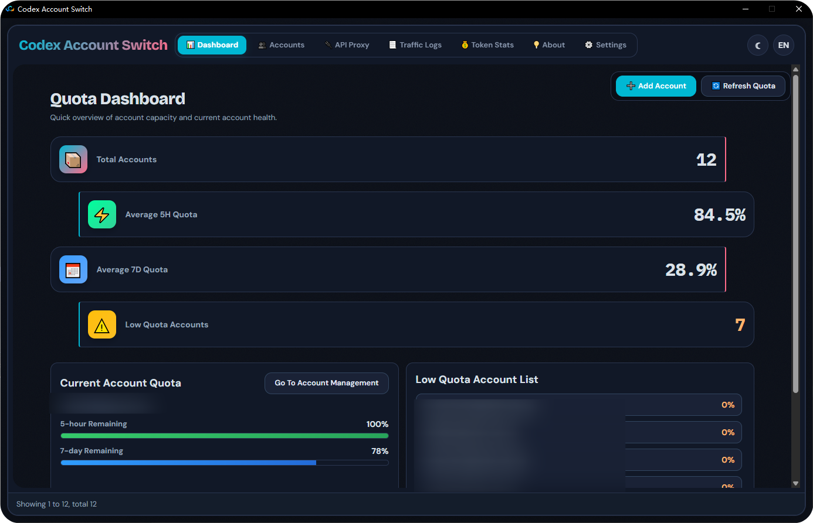
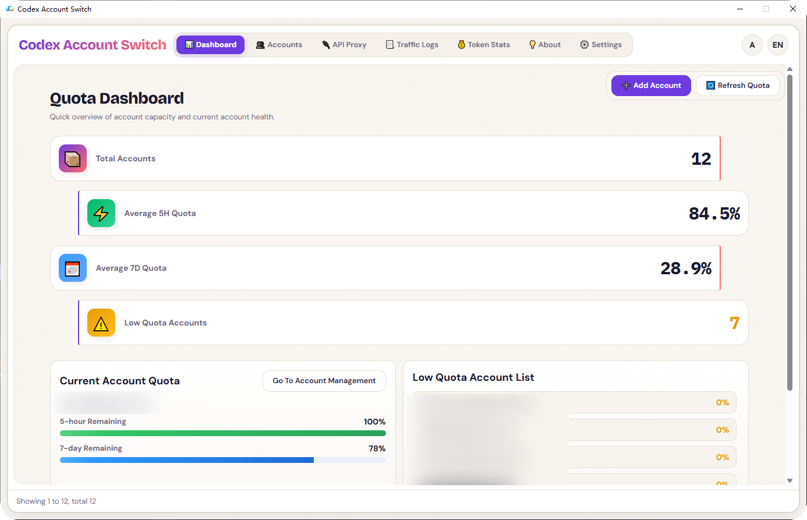
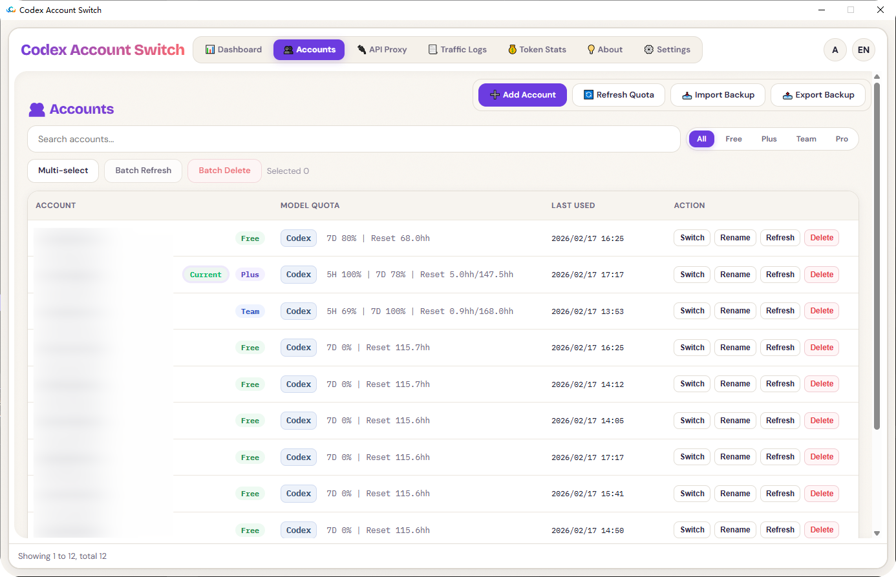
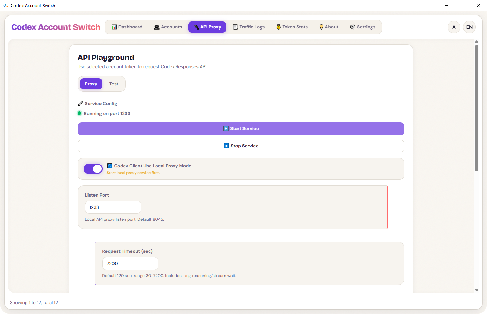
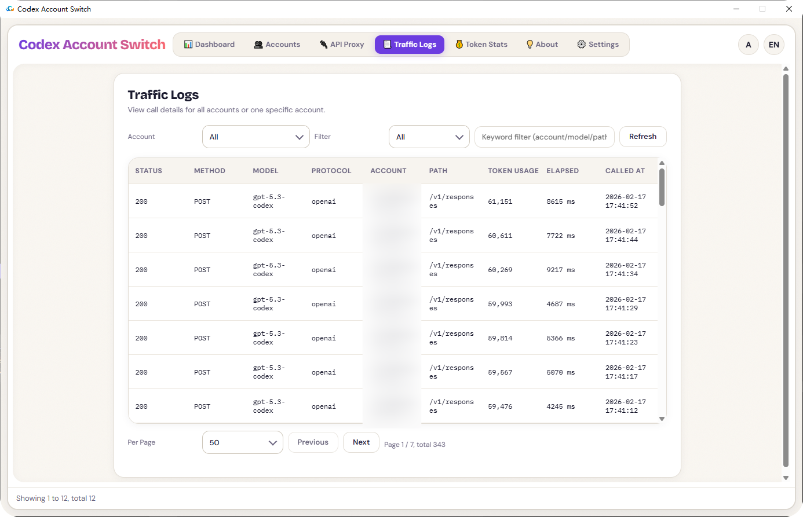
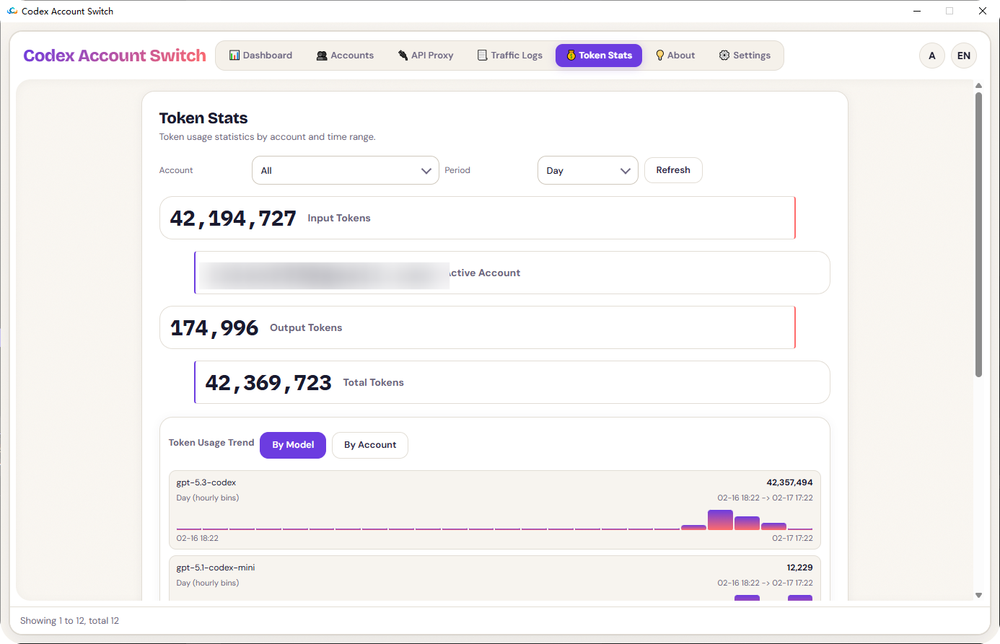
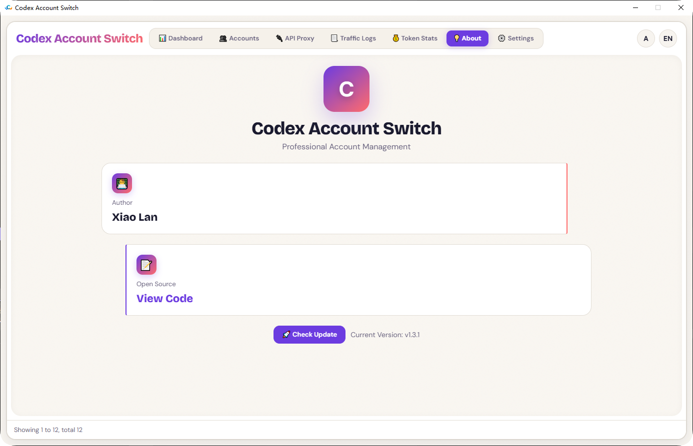
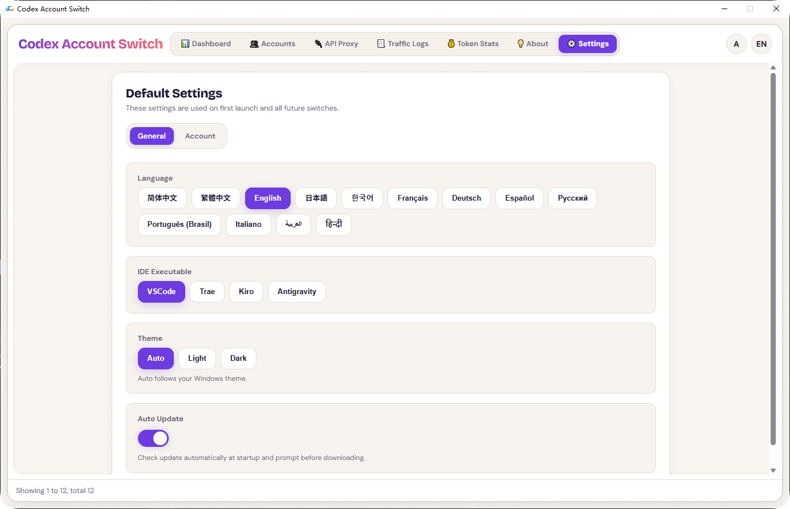

<h1 align="center"><b>Codex Account Switch</b></h1>

  <b>Local-first, multi-account, visual manager for Codex accounts</b> 
  Built with <code>C++ / Win32 / WebView2</code> for stability and speed.

  <a href="./README_CN.md"><b>简体中文 README</b></a>

## Core Features

- Unified workflow for backup / switch / delete / rename accounts
- Batch actions (batch refresh, batch delete)
- Import/export backup bundles (ZIP)
- Import current login, manual token paste, and quick OAuth file import
- Built-in OAuth login flow (callback listener + manual callback URL submit)
- Quota dashboard, auto-refresh (5H / 7D), low-quota alerts and switch prompts
- API proxy service (port, timeout, LAN access, API key, dispatch strategy)
- Traffic logs and token statistics pages
- Multi-language UI and themes (Auto / Light / Dark)

## Codex Client Local API Proxy for Seamless Number Switching
- API Reverse Proxy - Start Service
- API Reverse Proxy - Codex Client Uses Local Reverse Proxy Mode
- Enables seamless account switching without restarting
- Settings - Account - Automatic Account Switching Prompt for Low Credit Limit. Enabling this feature allows for automatic number switching to continue development work when credit limits are insufficient.

## UI Preview

### 1. Dashboard (Light)

  

### 1B. Dashboard (Dark)

  

### 2. Accounts

  

### 3. API Proxy

  

### 4. Traffic Logs

  

### 5. Token Stats

  

### 6. About

  

### 7. Settings

  

## Technical Architecture

- Native layer: `C++ / Win32 / WebView2`
- Frontend layer: `HTML + CSS + JavaScript`
- Bridge: WebView `postMessage` + host action routing
- Storage: local JSON files under user profile path

Main folders:

- `Codex_AccountSwitch/`: core C++ source
- `webui/`: frontend assets
- `installer/`: installer scripts
- `image/`: README screenshots

## Data Directory

Runtime data is stored in:

- `%LOCALAPPDATA%\Codex Account Switch\config.json`
- `%LOCALAPPDATA%\Codex Account Switch\backups\index.json`
- `%LOCALAPPDATA%\Codex Account Switch\backups\...`

## Installation Guide

### Requirements

- Windows 10/11 (x64/x86/ARM64 target build supported)
- WebView2 Runtime

### Build

1. Open solution: `Codex_AccountSwitch.slnx`
2. Select one of: `Release | x64`, `Release | x86`, `Release | ARM64`
3. Build outputs:
   - `Release/x64/Codex_AccountSwitch.exe`
   - `Release/x86/Codex_AccountSwitch.exe`
   - `Release/ARM/Codex_AccountSwitch.exe`

### Build Installer

- `installer/build_installer.bat` (recommended)
- `installer/build_installer.ps1`

Output folder: `dist/`

## Acknowledgements

- Thanks to the `Microsoft Edge WebView2` team for a stable, high-performance embedded web runtime.
- Thanks to all users and contributors for testing, bug reports, and feedback.
- Thanks to [router-for-me/CLIProxyAPI](https://github.com/router-for-me/CLIProxyAPI) for shared implementation ideas around Codex requests and OAuth retrieval.
- Thanks to [lbjlaq/Antigravity-Manager](https://github.com/lbjlaq/Antigravity-Manager) for shared UI and interaction design ideas.

## Contributors

- [isxlan0](https://github.com/isxlan0)

## License

Licensed under the `MIT License`. See `LICENSE`.

## Security Notice

All account data is stored locally by default. Data never leaves your device unless you explicitly export or share it.
