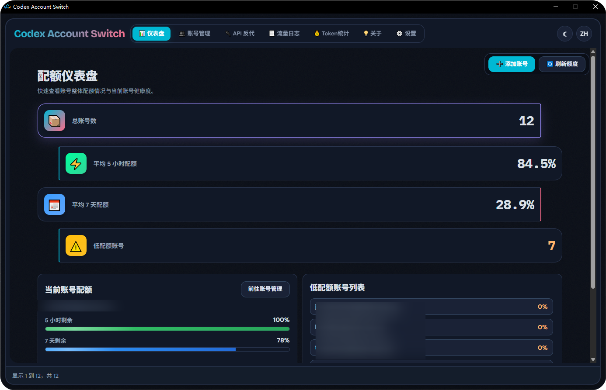
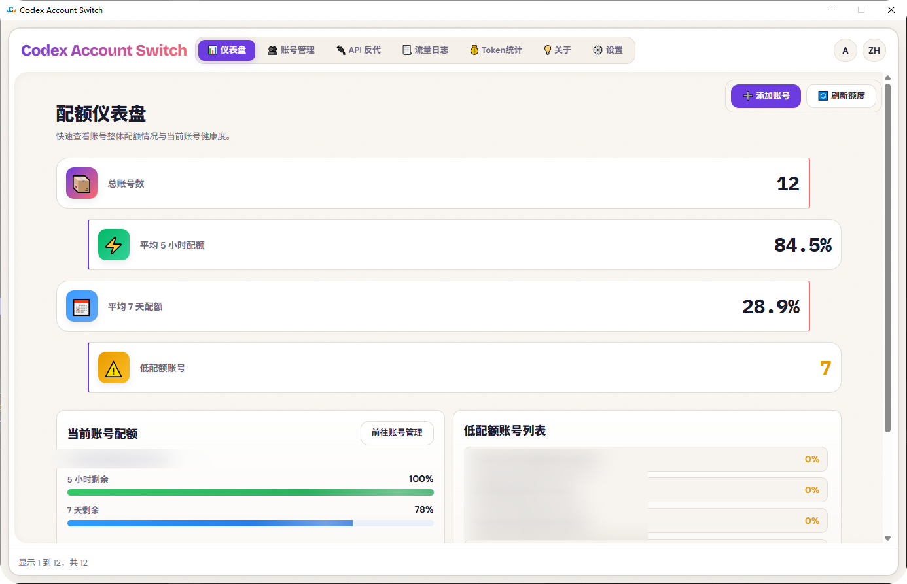
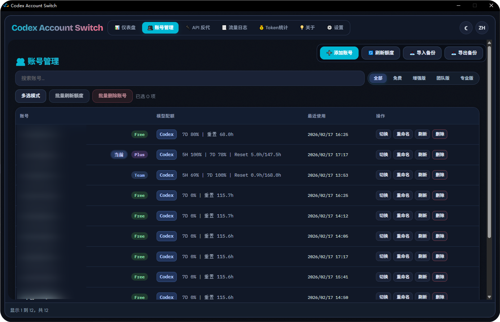
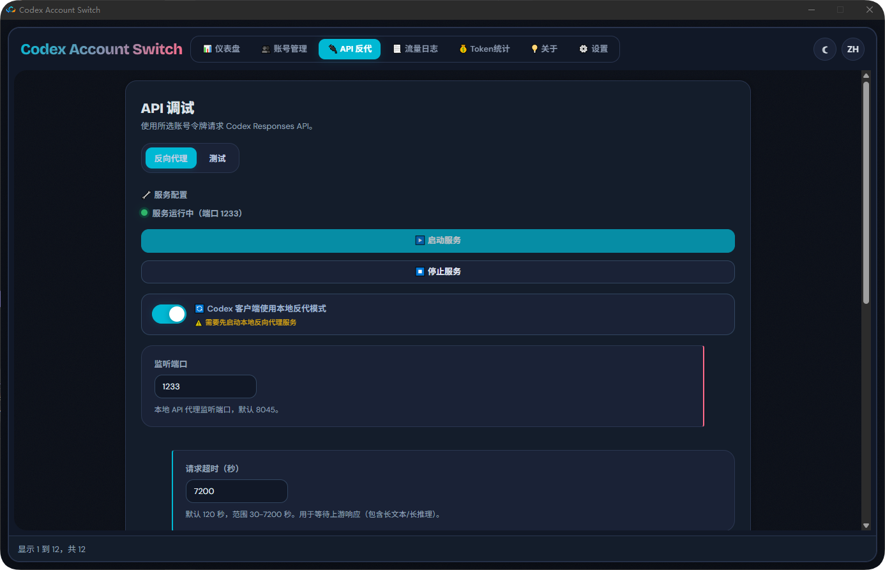
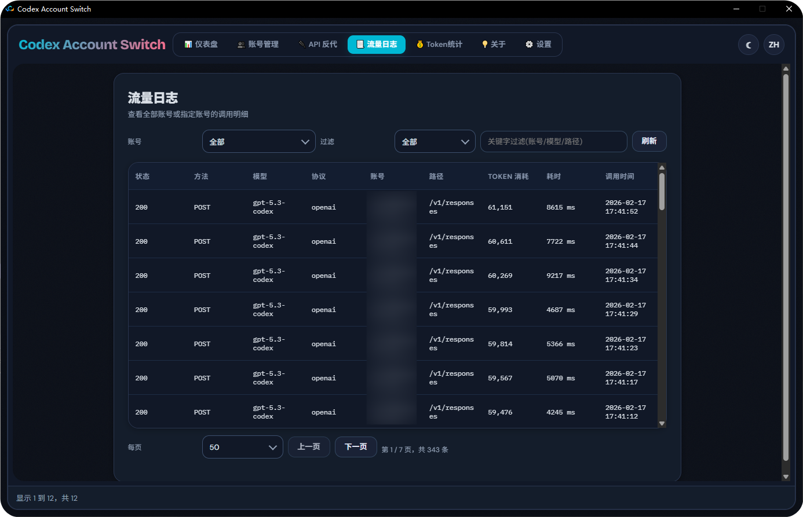
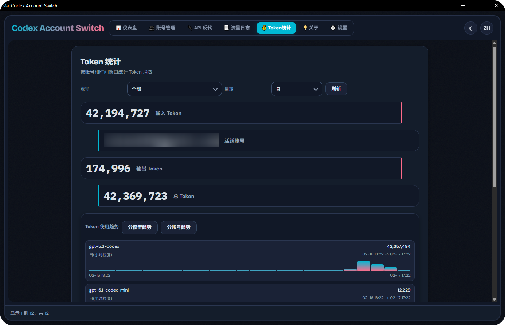
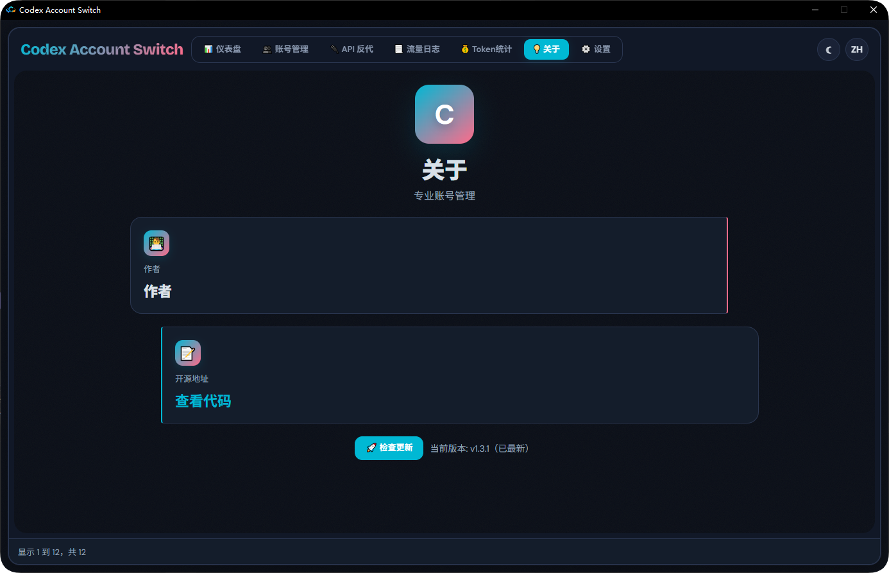
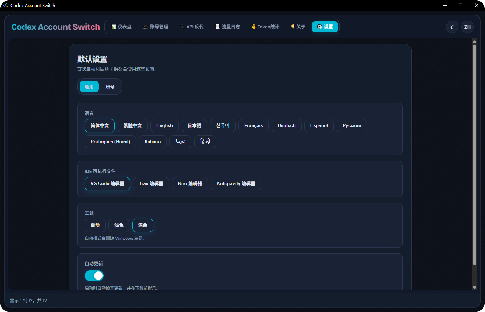

<h1 align="center"><b>Codex Account Switch</b></h1>

  <b>本地优先、多账号、可视化的 Codex 账号管理工具</b> 
  基于 <code>C++ / Win32 / WebView2</code> 构建，强调稳定与效率。

  <a href="./README.md"><b>English README</b></a>

## 核心功能

- 账号备份 / 切换 / 删除 / 重命名一体化管理
- 支持批量操作（批量刷新、批量删除）
- 支持导入/导出账号备份（ZIP）
- 支持导入当前登录账号、手动粘贴 Token、OAuth 文件快速导入
- 内置 OAuth 登录流程（含回调监听与手动粘贴回调链接）
- 配额看板与自动刷新（5H / 7D）、低额度提醒与切换提示
- API 反代服务（端口、超时、LAN、API Key、调度模式）
- 流量日志与 Token 统计页面
- 多语言与主题（自动 / 浅色 / 深色）

## Codex客户端本地API代理 实现无感换号效果
- APi反代-启动服务
- APi反代-Codex客户端使用本地反代模式
- 即可实现无需重启切换账号使用
- 设置-账号-低额度自动提示切换账号 开启后额度不够时自动换号进行继续开发工作

## 界面预览

### 1. 仪表盘（浅色）

  

### 1B. 仪表盘（深色）

  

### 2. 账号管理

  

### 3. API 反代

  

### 4. 流量日志

  

### 5. Token 统计

  

### 6. 关于

  

### 7. 设置

  

## 技术架构

- 原生层：`C++ / Win32 / WebView2`
- 前端层：`HTML + CSS + JavaScript`
- 通信方式：WebView `postMessage` + Host Action 路由
- 数据存储：本地 JSON 文件（用户目录）

主要目录：

- `Codex_AccountSwitch/`：核心 C++ 源码
- `webui/`：前端界面资源
- `installer/`：安装包脚本
- `image/`：README 演示图片

## 数据目录

运行时数据默认写入：

- `%LOCALAPPDATA%\Codex Account Switch\config.json`
- `%LOCALAPPDATA%\Codex Account Switch\backups\index.json`
- `%LOCALAPPDATA%\Codex Account Switch\backups\...`

## 安装指南

### 运行环境

- Windows 10/11 (x64/x86/ARM64 目标构建已支持)
- WebView2 Runtime

### 编译

1. 打开解决方案：`Codex_AccountSwitch.slnx`
2. 选择其一：`Release | x64`、`Release | x86`、`Release | ARM64`
3. 编译产物：
   - `Release/x64/Codex_AccountSwitch.exe`
   - `Release/x86/Codex_AccountSwitch.exe`
   - `Release/ARM/Codex_AccountSwitch.exe`

### 打包安装程序

- `installer/build_installer.bat`（推荐）
- `installer/build_installer.ps1`

输出目录：`dist/`

## 致谢

- 感谢 `Microsoft Edge WebView2` 团队提供稳定高性能的嵌入式 Web 运行时。
- 感谢所有参与测试、反馈问题和提出建议的用户与开发者。
- 感谢 [router-for-me/CLIProxyAPI](https://github.com/router-for-me/CLIProxyAPI) 分享 Codex 请求与 OAuth 获取相关实现思路。
- 感谢 [lbjlaq/Antigravity-Manager](https://github.com/lbjlaq/Antigravity-Manager) 分享 UI 与功能设计思路。

## 贡献者

- [isxlan0](https://github.com/isxlan0)

## 许可证

本项目采用 `MIT License`，详见 `LICENSE`。

## 安全说明

所有账号数据默认仅保存在本地。除非你主动导出或分享，数据不会离开你的设备。
